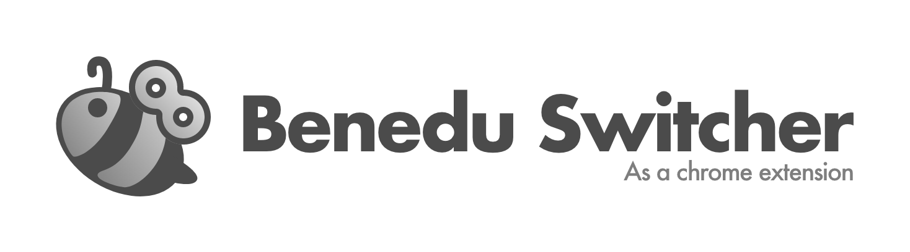
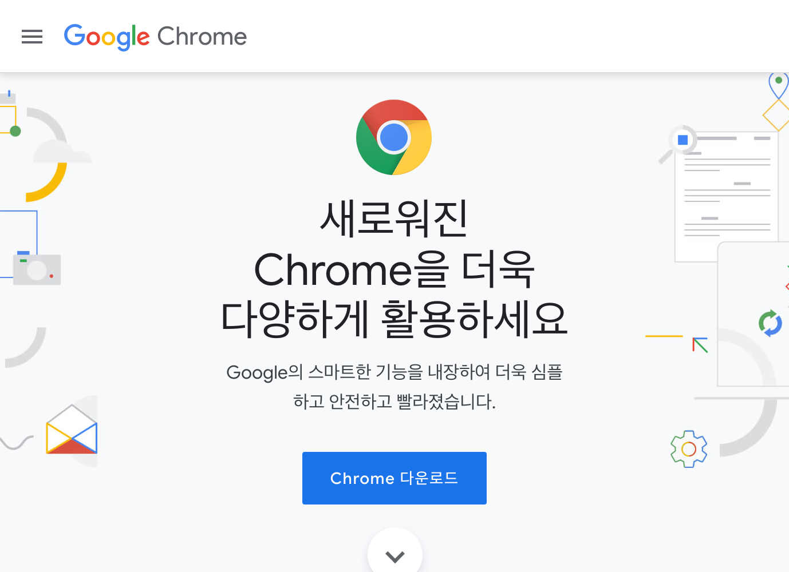

# Benedu Switcher Extension 

> 🌐→🐝

선생님이 오면 바로 베네듀를 열 수 있는 단축키를 제공하는 크롬 익스텐션이예요!

## 설치
1. [Chrome 다운로드 및 설치](#Chrome-설치)
2. [확장 프로그램 다운로드](#확장-프로그램-다운로드)
3. [확장 프로그램 설치](#확장-프로그램-설치)
4. [눈치보지 않고 IT 활동에 전념하기](#눈치보지-않고-IT-활동에-전념하기)

### Chrome 설치

> Chrome 브라우저 설치하기

본 플러그인은 아쉽게도 현재 Chrome만을 지원합니다. 아마 디미고 학생이라면 대부분 이미 사용하고 있겠지만, 혹시라도 아직 없다면 [Chrome 다운로드 링크](http://chrome.com)에서 다운받아 설치하세요!

### 확장 프로그램 다운로드

> 확장 프로그램 다운받기

이 GitHub 페이지 윗부분에 보면 초록색의 `Clone or Download` 버튼이 보일 거예요. 버튼을 누른 뒤, `Download ZIP`을 누르면 압축된 소스를 다운받을 수 있답니다. 다운받은 뒤 압축을 안전한 폴더에 풀어 주세요.

### 확장 프로그램 설치

> 확장 프로그램 설치 및 사용 설정

1. Chrome에 설치된 확장 프로그램을 관리할 수 있는 [chrome://extensions](chrome://extensions) 페이지로 이동하세요.

2. 오른쪽 위의 `개발자 모드` 스위치가 켜져 있는지 확인하세요.

3. 왼쪽 위의 `압축해제된 확장 프로그램을 로드합니다.` 버튼을 누른 뒤, 아까 압축을 푼 폴더(`manifest.json`이 존재하는 경로)를 선택하시면 설치 완료!

### 눈치보지 않고 IT 활동에 전념하기
이제 마음껏 노트북을 하다가 선생님께서 오시는 소리가 들리면 `Ctrl+X` 또는 `Command+X`를 누르면 됩니다!

현재 창에서 베네듀 탭이 이미 있다면 그 탭으로 이동하고, 켜져 있지 않다면 새로운 창이 생깁니다. 😋

## 추후 계획
- 😂 다음에는 여러분들께서 **언제, 어디서든 베네듀를 즐길 수 있도록** 다른 프로그램 사용 시에도 베네듀를 열 수 있는 프로그램들을 만들어 볼게요!

- 🎉 본 플러그인 역시 심심할 때마다 업데이트할 예정이예요. 

- ⭐️ 유용하게 사용하고 계신다면 GitHub **스타를 눌러주시면** 정말 고마울 것 같아요!
